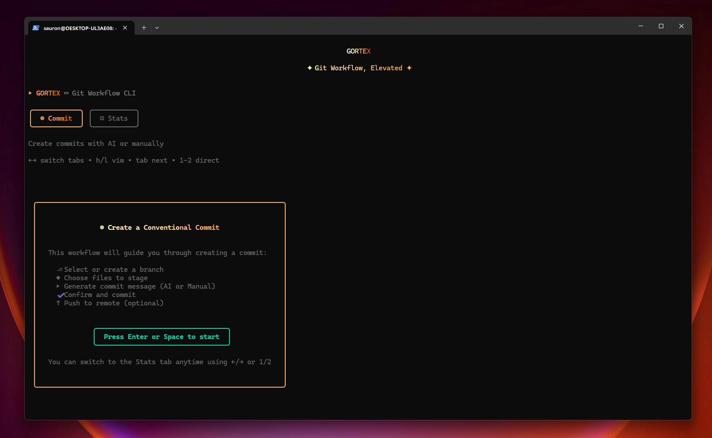

<div align="center">

# GORTEX CLI

[](https://www.npmjs.com/package/gortex-cli)
[](https://www.npmjs.com/package/gortex-cli)
[](https://opensource.org/licenses/MIT)

CLI for building reliable, assisted, and auditable conventional commits.

[Installation](#installation) • [Usage](#usage) • [Architecture](#architecture)

</div>



## Project goal

Gortex CLI makes the commit phase as rigorous as the implementation phase.

- **Guidance** – a multi-step flow that surfaces the right checks (branch, files, message, push)  
- **Consistency** – a builder aligned with the Conventional Commits spec, with real-time validation  
- **Contextual help** – AI-assisted generation (local or remote) and visual previews of staged files

The outcome is short, precise, review-friendly commits without leaving the terminal.

## Value proposition

- **Traceability** – every commit documents the need and scope  
- **Standardization** – conventions are enforced while the developer acts, not via a late lint  
- **Controlled AI** – Gortex auto-detects Ollama, Mistral, or OpenAI and stays local whenever possible  
- **End-to-end workflow** – branch selection, targeted staging, message generation, optional push

## Key capabilities

- Interactive 8-step workflow (branch ➜ files ➜ staging ➜ generation ➜ message ➜ confirmation ➜ push ➜ recap)
- Diff previews for staged files
- Commit generation via Ollama, Mistral AI, or OpenAI with automatic fallback to manual editing
- Keyboard-first navigation (Tab, arrows, Vim j/k/h/l, quick actions `a`, `i`)
- Real-time validation of conventional commits, including breaking-change handling
- `.gortexrc` configuration (Cosmiconfig) to tune AI providers, conventions, and git preferences

## Architecture

| Layer | Role | Key tech |
|-------|------|----------|
| Domain | Entities, value objects, contracts | TypeScript |
| Application | Use cases and orchestration | Services, DTOs, validation |
| Infrastructure | Git, AI providers, DI | simple-git, Ollama/OpenAI/Mistral adapters |
| Presentation | CLI interface | Ink, Commander, React components |

Reference points:

- 918 tests across 67 files (91.63 % coverage)  
- ~177.62 KB ESM bundle, ~1203 ms build  
- Node ≥ 18, distributed via npm/pnpm/yarn/bun  
- Full design notes in `docs/ARCHITECTURE.md`

## Installation

```bash
# npm
npm install -g gortex-cli

# pnpm (recommended)
pnpm add -g gortex-cli

# yarn
yarn global add gortex-cli

# bun
bun add -g gortex-cli

# try without installing
npx gortex-cli
```

## Usage

Run inside a Git repository:

```bash
gortex
```

The guided flow covers:

1. Selecting or creating the branch  
2. Picking files to commit with inline diff previews  
3. Staging the selected items  
4. Choosing AI or manual message creation  
5. Validating the message (including breaking changes)  
6. Confirming, optionally pushing, then reviewing the recap

Helpful commands:

```bash
gortex --help
gortex help-format
```

## AI integration

- **Ollama** (recommended):
  ```bash
  curl -fsSL https://ollama.com/install.sh | sh
  ollama pull devstral:24b
  ollama serve   # http://localhost:11434
  ```
- **Mistral / OpenAI**: automatically used when API keys are detected in the environment or config.
- Fallback sequence:
  1. Ollama when available (local & private)  
  2. Mistral / OpenAI depending on available keys  
  3. Manual editing if no provider responds

Tips:

- Keep `ollama serve` running to avoid repeated cold starts.  
- Match model size to your hardware (`phi:2.7b` for lightweight laptops, `mistral-nemo:12b` for workstations).  
- Keep commits focused so AI suggestions stay accurate.

## Conventional commits reference

| Type | Purpose |
|------|---------|
| `feat` | new feature |
| `fix` | bug fix |
| `docs` | documentation |
| `style` | formatting / non-functional |
| `refactor` | internal restructuring |
| `perf` | performance |
| `test` | tests |
| `build` | build/package |
| `ci` | continuous integration |
| `chore` | maintenance |

Examples:

```
feat(auth): add OAuth2 authentication
fix(api): resolve timeout on large requests
docs(readme): update installation instructions
refactor(core): simplify error handling
```

Breaking change:

```
feat(api)!: change authentication method

BREAKING CHANGE: Previous auth tokens are now invalid
```

## Contributing

1. Fork + feature branch  
2. `pnpm install`, `pnpm dev`  
3. Run `pnpm test`, `pnpm typecheck`, `pnpm lint` before submitting  
4. Use Gortex CLI to format your own commits

Additional docs:

- `CONTRIBUTING.md`
- `docs/ARCHITECTURE.md`
- `docs/USE_CASES.md`
- `docs/MIGRATION_GUIDE.md`

Repository overview:

```
gortex-cli/
├── src/
│   ├── domain/
│   ├── application/
│   ├── infrastructure/
│   ├── components/
│   └── commands/
├── docs/
└── __tests__/
```

## License

MIT © [Arthur Jean](https://github.com/ArthurDEV44)

<div align="center">

**[⬆ back to top](#gortex-cli)**

</div>

